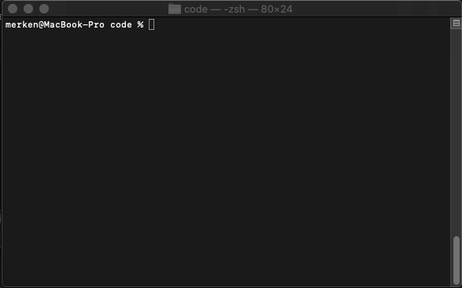
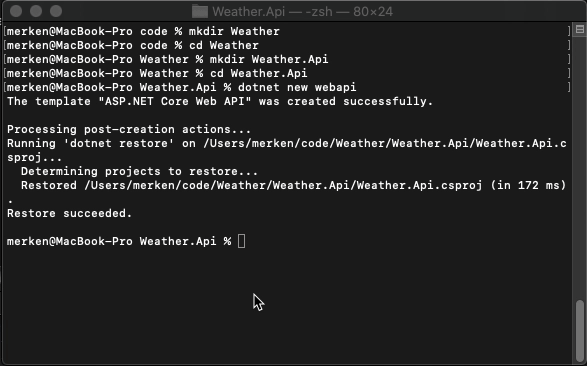
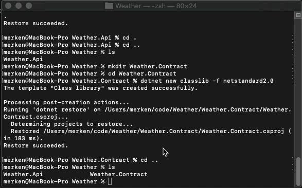
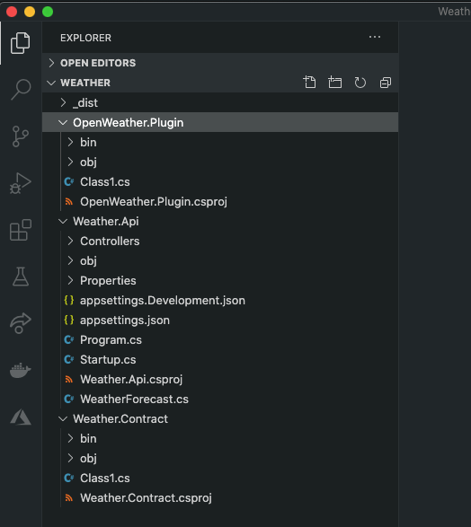
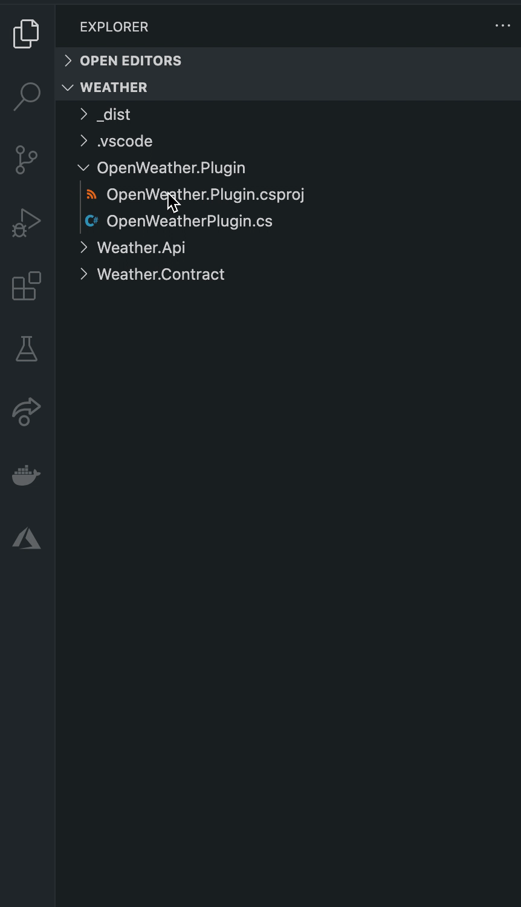
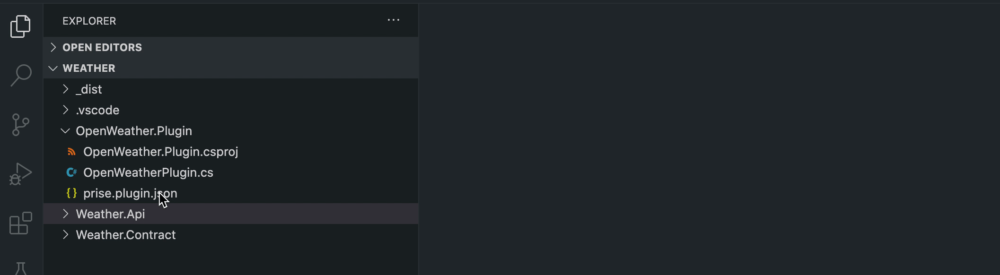
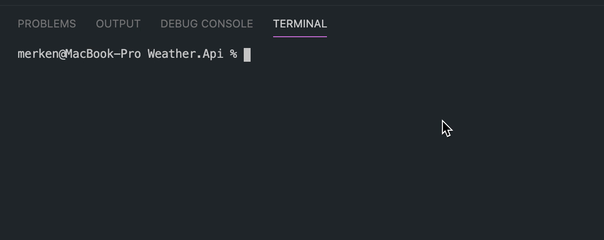
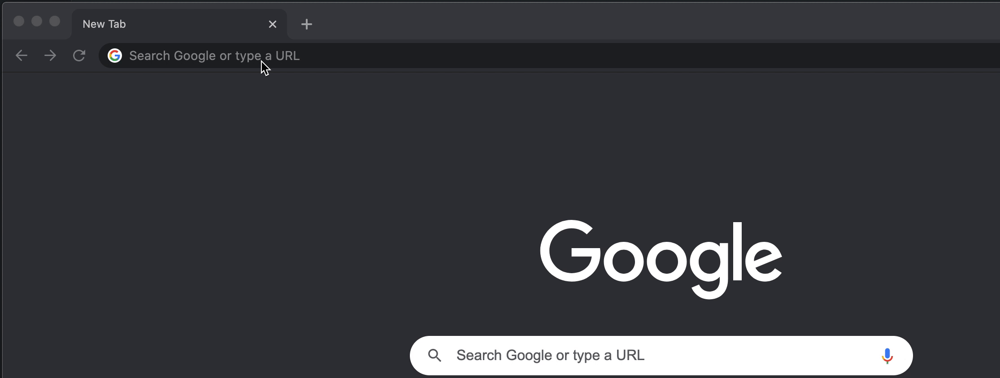
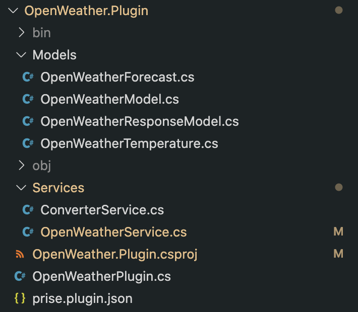
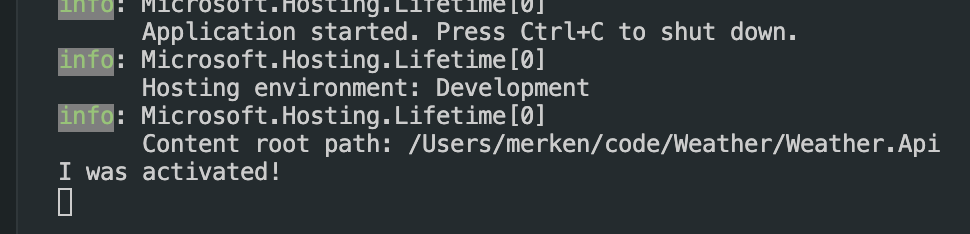

<p align="center">
  <a href="" rel="noopener">
 
</p>

<h3 align="center">Prise</h3>

<div align="center">

  []() 
  [](https://github.com/merken/prise/issues)
  [](https://github.com/merken/prise/pulls)
  [](https://www.nuget.org/packages/Prise)
  [](https://www.nuget.org/packages/Prise)

  [](https://github.com/merken/Prise/LICENSE)

</div>

---

<p align="center"> Prise, A .NET (Core) Plugin Framework.
    <br/> 
</p>

## 📝 Table of Contents
- [📝 Table of Contents](#-table-of-contents)
- [🧐 About](#-about)
- [🏁 Getting Started](#-getting-started)
  - [🌤️ The Weather Project](#️-the-weather-project)
  - [📝 Defining the Contract](#-defining-the-contract)
  - [🎩 Setting up the Host](#-setting-up-the-host)
  - [🔌 Your First Prise Plugin](#-your-first-prise-plugin)
  - [🏁 Wrapping it up](#-wrapping-it-up)
- [🛠️ Advanced Plugins](#️-advanced-plugins)
  - [🔌 Plugin Services](#-plugin-services)
    - [🥾 IPluginBootstrapper](#-ipluginbootstrapper)
  - [🎩 Host Services](#-host-services)
  - [📡 Plugin Activation](#-plugin-activation)
  - [⚙️ Configuring the PluginLoadContext](#️-configuring-the-pluginloadcontext)
  - [📦 Nuget Package support](#-nuget-package-support)
  - [☝️ Tips](#️-tips)
- [🧪 Testing](#-testing)
  - [🎩 Testing Hosts](#-testing-hosts)
  - [🔌 Testing Plugins](#-testing-plugins)
- [✅ Prerequisites](#-prerequisites)
- [🚀 Toolset](#-toolset)
- [📜 Examples](#-examples)
- [✍️ Authors](#️-authors)

## 🧐 About
<a name="about"></a>

**Prise** is a plugin framework for .NET (Core) applications, written in .NET (Core). The goal of Prise, is enable you to write **decoupled pieces of code** using the least amount of effort, whilst **maximizing the customizability and backwards-compatability**. Prise helps you load plugins from foreign assemblies. It is built to decouple the local and remote dependencies, and strives to avoid assembly mismatches.

Main features:

- Easy setup
- Fully customizable loading of plugins
- Loading plugins from Prise Plugin Packages (Nuget)
- Supporting backwards compatibility for older (previously written) plugins

## 🏁 Getting Started
<a name="getting-started"></a>

A plugin system, of any kind, consists of the following components:
- 🎩 **Host**: The Host application, your Console app, ASP.NET Core Web app, an Azure Function Host, ...
- 📝 **Contract**: The shared library between the Host and the Plugin, contains all operations the Host can invoke on the Plugin
- 🔌 **Plugin**: A plugin assembly that contains at least 1 implementation of the Contract

### 🌤️ The Weather Project
<a name="the-weather-project"></a>

[ASP.NET Core scaffolds](https://docs.microsoft.com/en-us/aspnet/core/tutorials/first-web-api?view=aspnetcore-3.1&tabs=visual-studio) a ```WeatherForecastController``` when a new ```webapi``` project is created, our example will extend this project with an [OpenWeatherMap](https://openweathermap.org) Plugin.

Let's create the ```Weather.Api``` **Host** for our Weather project from scratch using the Weather webapi template from ASP.NET Core:

```
mkdir Weather
cd Weather
mkdir Weather.Api
cd Weather.Api
dotnet new webapi
```



Next, we need to create the **Contract** ```Weather.Contract``` project:
```
cd ..
mkdir Weather.Contract
cd Weather.Contract
dotnet new classlib -f netstandard2.0
```



This project does not need to be anything other than a netstandard library, it does not require any dependencies either.

Now, we create our plugin ```OpenWeather.Plugin``` project:

```
cd ..
mkdir OpenWeather.Plugin
cd OpenWeather.Plugin
dotnet new classlib -f netcoreapp3.1
```



While you **can** create ```netstandard``` plugins, it is best to choose a specific framework for your **Plugin**, like ```netcoreapp2.1```, ```netcoreapp3.1``` or ```net5.0```.

When we open the ```Weather``` directory in VS Code, we can see that projects are ready:



**Prise** comes with a toolset for VS Code and Visual Studio, install the [Prise Publish Plugin Extension for VS Code](https://marketplace.visualstudio.com/items?itemName=MRKN.prise-publishpluginextension) from the Marketplace.

Now we're all set to start plugging in Prise!

### 📝 Defining the Contract
<a name="defining-the-contract"></a>

Create a new C# interface file inside the Weather.Contract project named ```IWeatherPlugin.cs```:
```csharp
using System;
using System.Collections.Generic;
using System.Threading.Tasks;

namespace Weather.Contract
{
    public class WeatherForecast
    {
        /// <summary>
        /// Day of the week
        /// </summary>
        /// <value></value>
        public DateTime Date { get; set; }

        /// <summary>
        /// Overall temperature in Celsius
        /// </summary>
        /// <value></value>
        public int TemperatureC { get; set; }

        /// <summary>
        /// Short summary of the weather for that day
        /// </summary>
        /// <value></value>
        public string Summary { get; set; }
    }

    public interface IWeatherPlugin
    {
        Task<IEnumerable<WeatherForecast>> GetWeatherFor(string location);
    }
}
```
Each **Plugin** is responsible for returning a list of ```WeatherForecast``` for a given location. We will implement the OpenWeather.Plugin later.


### 🎩 Setting up the Host
<a name="setting-up-the-host"></a>

Add the Prise NuGet package to Weather.Api **🎩 Host** project:

```
dotnet add package Prise
```

Add the Weather.Contract project reference:

```
dotnet add reference ../Weather.Contract
```


Add the following lines to your Startup.cs file:
<pre>
// This method gets called by the runtime. Use this method to add services to the container.
public void ConfigureServices(IServiceCollection services)
{
    services.AddControllers();
    <b>services.AddPrise();</b>
}
</pre>

You can now inject the [IPluginLoader](https://raw.githubusercontent.com/merken/Prise/v2/src/Prise/IPluginLoader.cs) into your ```WeatherForecastController```:
```csharp
using System;
using System.Collections.Generic;
using System.Linq;
using System.Threading.Tasks;
using Microsoft.AspNetCore.Mvc;
using Microsoft.Extensions.Logging;
// Add Prise
using Prise;
// Add the Contract
using Weather.Contract;

namespace Weather.Api.Controllers
{
    [ApiController]
    [Route("[controller]")]
    public class WeatherForecastController : ControllerBase
    {
        private static readonly string[] Summaries = new[]
        {
            "Freezing", "Bracing", "Chilly", "Cool", "Mild", "Warm", "Balmy", "Hot", "Sweltering", "Scorching"
        };

        private readonly ILogger<WeatherForecastController> _logger;
        // Inject the Prise Default IPluginLoader
        private readonly IPluginLoader weatherPluginLoader;

        public WeatherForecastController(ILogger<WeatherForecastController> logger, IPluginLoader weatherPluginLoader)
        {
            _logger = logger;
            this.weatherPluginLoader = weatherPluginLoader;
        }

        // ... removed for brevity
```

The ```IPluginLoader``` is a Prise type that allows you find and load Plugins.

We will publish the ```OpenWeather.Plugin``` to the ```_dist``` folder created at the root of our project, which means that the ```WeatherForecastController``` needs to look for Plugins from that directory on the local disk.

Let's write some code inside the ```WeatherForecastController``` to do that:

Change the default implementation of the ```Get``` method.
```csharp
 // Add the location parameter to the route
[HttpGet("{location}")]
public async Task<IEnumerable<WeatherForecast>> Get(string location)
{
    // pathToBinDebug = Weather.Api/bin/Debug/netcoreapp3.1
    var pathToBinDebug = Path.GetDirectoryName(Assembly.GetExecutingAssembly().Location);
    // pathToDist = _dist
    var pathToDist = Path.GetFullPath("../../../../_dist", pathToBinDebug);
    // scanResult should contain the information about the OpenWeather.Plugin
    var scanResult = await this.weatherPluginLoader.FindPlugin<IWeatherPlugin>(pathToDist);

    if (scanResult == null)
    {
        _logger.LogWarning($"No plugin was found for type {typeof(IWeatherPlugin).Name}");
        return null;
    }

    // Load the IWeatherPlugin
    var plugin = await this.weatherPluginLoader.LoadPlugin<IWeatherPlugin>(scanResult);

    // Invoke the IWeatherPlugin
    return await plugin.GetWeatherFor(location);
}
```

Remove the ~```WeatherForecast.cs```~ file located in the root of the ```Weather.Api``` project, this forces the ```WeatherForecastController``` to use the ```WeatherForecast``` class from the ```Weather.Contract```.


### 🔌 Your First Prise Plugin
<a name="your-first-prise-plugin"></a>

Add the ```Prise.Plugin``` package to the ```OpenWeather.Plugin``` project:
```
dotnet add package Prise.Plugin
```

And add the reference to the ```Weather.Contract```:
```
dotnet add reference ../Weather.Contract
```

Change the filename from ```Class1.cs``` to ```OpenWeatherPlugin.cs``` and make the file to look like a Plugin:
```csharp
using System;
using System.Collections.Generic;
using System.Linq;
using System.Net.Http;
using System.Text.Json;
using System.Threading.Tasks;
using Prise.Plugin;
using Weather.Contract;

namespace OpenWeather.Plugin
{
    // This makes the Plugin discoverable for Prise
    [Plugin(PluginType = typeof(IWeatherPlugin))]
    public class OpenWeatherPlugin : IWeatherPlugin
    {
        // The Contract method we need to implement
        public async Task<IEnumerable<WeatherForecast>> GetWeatherFor(string location)
        {
            var openWeatherApi = "https://api.openweathermap.org/data/2.5/";
            var apiKey = "fd1f28913df6e270e48ea04536e3daba";
            var forecastEndpoint = $"forecast?q={location}&appid={apiKey}";

            var httpClient = new HttpClient();
            httpClient.BaseAddress = new Uri(openWeatherApi);

            var response = await httpClient.GetAsync(forecastEndpoint);
            if (!response.IsSuccessStatusCode)
                throw new Exception("API did not respond with success.");

            var content = await response.Content.ReadAsStringAsync();
            var openWeatherModel = JsonSerializer.Deserialize<OpenWeatherResponseModel>(content);
            var results = openWeatherModel.list.Select(m => MapToWeatherForecast(m));
            var resultsPerDay = results.GroupBy(r => r.Date.DayOfWeek).Select(g => g.First());

            return resultsPerDay;
        }

        private WeatherForecast MapToWeatherForecast(OpenWeatherModel model)
        {
            return new WeatherForecast
            {
                Date = FromUnix(model.dt),
                Summary = model.weather.ElementAt(0).description,
                TemperatureC = FromKelvinToCelsius(model.main.temp)
            };
        }

        private DateTime FromUnix(long unixTimeStamp)
            => new DateTime(1970, 1, 1, 0, 0, 0, 0, System.DateTimeKind.Utc).AddSeconds(unixTimeStamp).ToLocalTime();

        private int FromKelvinToCelsius(decimal kelvin)
            => (int)(kelvin - 273.15m);
    }

    class OpenWeatherForecast
    {
        public string main { get; set; }
        public string description { get; set; }
    }

    class OpenWeatherTemperature
    {
        // Temperature in Kelvin
        public decimal temp { get; set; }
    }

    class OpenWeatherModel
    {
        // Day of the week
        public long dt { get; set; }
        public OpenWeatherTemperature main { get; set; }
        public List<OpenWeatherForecast> weather { get; set; }
    }

    class OpenWeatherResponseModel
    {
        public List<OpenWeatherModel> list { get; set; }
    }
}

```

The implementation of the ```IWeatherPlugin``` interface is **optional**, as long as you expose a method called ```GetWeatherFor(string location)``` with the correct **return type** and **parameters**, Prise should be able to invoke this Plugin! 
**Prise** will look for a class that is annotated with the ```[Plugin]``` attribute that references the **Contract** (```IPlugin```).

This means that your Weather.Contract can grow and expand to support new logic, whilst remaining the ability to invoke older, previously built plugins.

### 🏁 Wrapping it up
<a name="wrapping-it-up"></a>

At this point we've determined the **Contract** (```Weather.Contract```), got the **Host** (```Weather.Api```) ready to look for ```IWeatherPlugin``` Plugins and invoke them, and we've written our first **Plugin** (```OpenWeather.Plugin```).
Now, we need to build the Plugin and copy it the the _dist folder so that the Host can find it.

With the [Prise Publish Plugin Extension for VS Code](https://marketplace.visualstudio.com/items?itemName=MRKN.prise-publishpluginextension) you can easily publish your Plugins from inside the editor.
**Right-click** on the ```OpenWeather.Plugin.csproj``` file inside of VS Code and select ```Create Prise Plugin File```



A new .json file will be scaffolded into the ```OpenWeather.Plugin``` directory named ```prise.plugin.json```.
This file contains **configuration** about how you want to **publish** your Plugin using the extension.

Open the ```prise.plugin.json``` file and change the ```publishDir``` setting to ```../_dist```. The ```publishDir``` setting can be a **relative** or an **absolute** path on the filesystem.
Each Plugin can have its own prise.plugin.json file.



When this is configured, you should be able to Right-click the ```OpenWeather.Plugin.csproj``` again and select ```Publish Prise Plugin```.


This command **builds** and **publishes** your **Plugin** using the ```dotnet publish``` cli command, the output of the publish is copied over to the ```publishDir``` location.

Now we can ```dotnet run``` the ```Weather.Api``` project and send our first request!

```
cd Weather.Api
dotnet run
```



Inside a browser navigate to https://localhost:5001/weatherforecast/brussels,be to see the forecast of Brussels.


<h3>But wait, there's more!</h3>

With the **Host** (```Weather.Api```) still running, let's **change the code** in the ```OpenWeather.Plugin``` and re-publish it, without restarting the **Host** application 😲
Change the code of the ```GetWeatherFor(string location)``` method to include only the forecast for **today**:
 ```csharp
public async Task<IEnumerable<WeatherForecast>> GetWeatherFor(string location)
{
    var openWeatherApi = "https://api.openweathermap.org/data/2.5/";
    var apiKey = "fd1f28913df6e270e48ea04536e3daba";
    var forecastEndpoint = $"forecast?q={location}&appid={apiKey}";

    var httpClient = new HttpClient();
    httpClient.BaseAddress = new Uri(openWeatherApi);

    var response = await httpClient.GetAsync(forecastEndpoint);
    if (!response.IsSuccessStatusCode)
        throw new Exception("API did not respond with success.");

    var content = await response.Content.ReadAsStringAsync();
    var openWeatherModel = JsonSerializer.Deserialize<OpenWeatherResponseModel>(content);
    var results = openWeatherModel.list.Select(m => MapToWeatherForecast(m));
    var resultsPerDay = results.GroupBy(r => r.Date.DayOfWeek).Select(g => g.First());

    // Return only today's forecast
    return resultsPerDay.Where(r => r.Date.DayOfWeek == DateTime.Today.DayOfWeek);
}
 ```


Did you see that,  we hot-swapped the Plugin on a running Host!

🎉 This concludes the Getting-Started section, in the next section we will look at how to add **services** to the **Plugin** and how to **interact** with the **Host**.
[You can check out a working example of 🌤️ The Weather Project on Github](https://github.com/merken/Weather/tree/getting-started)

## 🛠️ Advanced Plugins
<a name="advanced-plugins"></a>

Looking at our code from the ```OpenWeather.Plugin```, we can identify several **code smells**.
- Our OpenWeather **endpoint** is hardcoded
- Our OpenWeather **Api Key** is exposed in the source code
- We can identify pieces of logic that is best written into separate services:
  - **HttpClient**
  - **MapToWeatherForecast**
- All the **OpenWeather Models** need to move to their own folder

We can identity 2 main subroutines in our ```OpenWeather.Plugin```:
- Get data from **OpenWeather**
- Convert the data into ```WeatherForecast``` objects as mandated by the ```Weather.Contract```

We will create 2 services for this:
- OpenWeatherService
- ConverterService

Create a new directory inside the ```OpenWeather.Plugin``` directory called ```Services``` and add two .cs files:
- OpenWeatherService.cs
- ConverterService.cs

Change the the ```OpenWeatherService.cs``` file to look like:
```csharp
using System;
using System.Net.Http;
using System.Text.Json;
using System.Threading.Tasks;
using OpenWeather.Plugin.Models;

namespace OpenWeather.Plugin.Services
{
    internal interface IOpenWeatherService
    {
        Task<OpenWeatherResponseModel> GetForecastsFor(string location);
    }

    internal class OpenWeatherService : IOpenWeatherService
    {
        private readonly HttpClient client;
        private readonly string forecastApiFormat;

        public OpenWeatherService(HttpClient client)
        {
            this.client = client;
            // TODO get API KEY from configuration
            var apiKey = "fd1f28913df6e270e48ea04536e3daba";
            this.forecastApiFormat = "forecast?q={0}&appid=" + apiKey;
        }

        public async Task<OpenWeatherResponseModel> GetForecastsFor(string location)
        {
            var response = await this.client.GetAsync(String.Format(this.forecastApiFormat, location));
            if (!response.IsSuccessStatusCode)
                throw new Exception("API did not respond with success.");

            var content = await response.Content.ReadAsStringAsync();
            return JsonSerializer.Deserialize<OpenWeatherResponseModel>(content);
        }
    }
}
```
You will notice that the ```OpenWeatherService``` constructor requires an ```HttpClient```, we will use **Dependency Injection** to inject this later.

Before we change the ```ConverterService```, we first need to add another **package** (AutoMapper) to the ```OpenWeather.Plugin``` project.

```
dotnet add package AutoMapper
```

Change the ```ConverterService.cs``` file to look like:
```csharp
using System;
using System.Collections.Generic;
using System.Linq;
using AutoMapper;
using OpenWeather.Plugin.Models;
using Weather.Contract;

namespace OpenWeather.Plugin.Services
{
    internal class WeatherForecastMapperProfile : Profile
    {
        public WeatherForecastMapperProfile()
        {
            CreateMap<OpenWeatherModel, WeatherForecast>()
                .ForMember(w => w.Date, opt => opt.MapFrom(m => FromUnix(m.dt)))
                .ForMember(w => w.Summary, opt => opt.MapFrom(m => m.weather.ElementAt(0).description))
                .ForMember(w => w.TemperatureC, opt => opt.MapFrom(m => FromKelvinToCelsius(m.main.temp)));
        }

        private DateTime FromUnix(long unixTimeStamp)
                    => new DateTime(1970, 1, 1, 0, 0, 0, 0, System.DateTimeKind.Utc).AddSeconds(unixTimeStamp).ToLocalTime();

        private int FromKelvinToCelsius(decimal kelvin)
            => (int)(kelvin - 273.15m);
    }
    
    internal interface IConverterService
    {
        IEnumerable<WeatherForecast> ConvertToWeatherForecasts(OpenWeatherResponseModel responseModel);
    }

    internal class ConverterService : IConverterService
    {
        private readonly IMapper mapper;

        public ConverterService()
        {
            this.mapper = new MapperConfiguration(cfg => cfg.AddProfile<WeatherForecastMapperProfile>()).CreateMapper();
        }

        public IEnumerable<WeatherForecast> ConvertToWeatherForecasts(OpenWeatherResponseModel responseModel)
        {
            return 
                this.mapper.Map<List<WeatherForecast>>(responseModel.list)
                .GroupBy(r => r.Date.DayOfWeek).Select(g => g.First());
        }
    }
}
```

Lastly, just to tidy up, move all the **OpenWeater models** from the ```OpenWeatherPlugin.cs``` file into their own **Models** folder.
Your project structure should something like this:


### 🔌 Plugin Services
<a name="plugin-services"></a>

In the section above, we've abstracted the ```OpenWeatherPlugin.cs``` logic into 2 new services:
- OpenWeatherService.cs
- ConverterService.cs

Now, we will have to register them using a ```IPluginBootstrapper``` and inject them into our ```OpenWeatherPlugin.cs``` using **Field Injection**.

#### 🥾 IPluginBootstrapper
<a name="ipluginbootstrapper"></a>

Each **Plugin**, when activated, receives a fresh ```IServiceCollection```. This collection can be filled with services you may want to use inside of your Plugin domain.
In fact, everytime you Load a plugin (via the ```IPluginLoader.LoadPlugin<T>(scanResult)``` call) a new ```IServiceCollection``` is created and provided to the Plugin.
Once the lifetime of the ```IPluginLoader``` is reached or the ```IPluginLoader``` is disposed (via the ```IDisposable.Dispose()``` call), all the loaded plugins, along with their services will be disposed.

The ```IPluginBootstrapper``` is a interface that gives you to ability to register services to this ```IServiceCollection```, so that you can have them **injected** into your **Plugin** and other services within your Plugin domain.
*eg: OpenWeatherService, ConverterService*

In The Weather Project example, we currently have 3 services we need to configure:
- HttpClient (for OpenWeatherService.cs)
- OpenWeatherService (for our OpenWeatherServicePlugin)
- ConverterService (for our OpenWeatherServicePlugin)

Similar to how Prise looks for Plugins inside of assemblies by looking for the ```[Plugin]``` attribute on classes, Prise looks for classes that are annotated with the ```[PluginBootstrapper]``` attribute.
Each plugin can have 1 ```IPluginBootstrapper```, but you can use 1 ```IPluginBootstrapper``` for multiple plugins by annotating it with multiple ```[PluginBootstrapper]``` attributes.

Let's write the ```IPluginBootstrapper``` for our ```OpenWeatherPlugin```, create a file named ```OpenWeatherPluginBootstrapper.cs``` inside the ```OpenWeather.Plugin``` project directory:
```csharp
using System;
using System.Net.Http;
using Microsoft.Extensions.DependencyInjection;
using OpenWeather.Plugin.Services;
using Prise.Plugin;

namespace OpenWeather.Plugin
{
    // This bootstrapper is linked to our OpenWeatherPlugin class
    [PluginBootstrapper(PluginType = typeof(OpenWeatherPlugin))]
    public class OpenWeatherPluginBootstrapper : IPluginBootstrapper
    {
        // A fresh IServiceCollection is provided upon activation of the OpenWeatherPlugin
        public IServiceCollection Bootstrap(IServiceCollection services)
        {
            // Add the HttpClient
            services.AddScoped<HttpClient>(sp =>
            {
                var client = new HttpClient();
                // TODO get the endpoint from configuration
                var endpoint = "https://api.openweathermap.org/data/2.5/";
                client.BaseAddress = new Uri(endpoint);
                return client;
            });

            // Add the domain services using an interface registration
            services.AddScoped<IOpenWeatherService, OpenWeatherService>();
            services.AddScoped<IConverterService, ConverterService>();

            return services;
        }
    }
}
```

When Prise activates the ```OpenWeatherPlugin```, it will first configure this  ```IServiceCollection``` using the dedicated ``OpenWeatherPluginBootstrapper```.
Now we need to tell Prise to inject the required services into the ```OpenWeatherPlugin.cs``` class.

We've tried various methods of having services injected, **Contructor Injection** did not work, because the .NET runtime will throw an exception when the **Contract** mismatches, loosing our backwards compatability.
We also tried a **Factory Method** for each **Plugin**, this method receives the configured ```IServiceCollection``` from the ```IPluginBootstrapper```, but this also threw errors when trying to resolve services that live inside the Host (see Host Services below).

The most robust way of injecting services is using **Field Injection** and set them after the **Plugin** is instantiated, via **Reflection**.
When the **Contract** mismatches during **Field Injection**, an **ArgumentException** is thrown, **but the field value is still set**. Meaning, the **Plugin** can function as intented.

Prise will scan a Plugin for ```[PluginService]``` attributes and resolve the ```ServiceType``` against any service registered in the ```IServiceCollection``` and set the value of this field using **Reflection**.

Looking at our ```OpenWeatherPlugin.cs```, we need to inject the ```IOpenWeatherService``` and ```IConverterService```.
The ```HttpClient``` will be injected into the ```OpenWeatherService``` using standard **Constructor Injection**, because it is part of the ```IServiceCollection``` and not required at level of the ```OpenWeatherPlugin```.

Let's write the code for the Field Injection of these services.
```csharp
using System;
using System.Collections.Generic;
using System.Linq;
using System.Net.Http;
using System.Text.Json;
using System.Threading.Tasks;
using Prise.Plugin;
using Weather.Contract;
using OpenWeather.Plugin.Services;

namespace OpenWeather.Plugin
{
    // This makes the Plugin discoverable for Prise
    [Plugin(PluginType = typeof(IWeatherPlugin))]
    public class OpenWeatherPlugin : IWeatherPlugin
    {
        // This tells Prise to inject a service from the IPluginBootstrapper IServiceCollection
        [PluginService(ServiceType = typeof(IOpenWeatherService))]
        private readonly IOpenWeatherService openWeatherService;

        // This tells Prise to inject a service from the IPluginBootstrapper IServiceCollection
        [PluginService(ServiceType = typeof(IConverterService))]
        private readonly IConverterService converter;

        public async Task<IEnumerable<WeatherForecast>> GetWeatherFor(string location)
        {
            var openWeatherResponseModel = await this.openWeatherService.GetForecastsFor(location);

            return this.converter.ConvertToWeatherForecasts(openWeatherResponseModel);
        }
    }
}
```

Note that, we've **not changed anything** in our ```Weather.Api``` **Host** project! This project could've been running the whole time, we just need to re-publish the ```OpenWeatherPlugin``` from time to time and invoke the Api endpoint to see the results: https://localhost:5001/weatherforecast/brussels,be

A working example of this setup can be found on [🌤️ The Weather Project Github](https://github.com/merken/Weather/tree/plugin-services)

### 🎩 Host Services
<a name="host-services"></a>

Plugins are **never meant to be fully isolated**, mostly they require some sort of **data** or **configuration** that only the **Host** can provide.
In this section we will look into how we can **share information** from the **Host** into the **Plugin**.

In order to maximize backwards compatability, the **Plugin** should, ideally, not use any of the **Host** services, another way to get around this, is to provide all the required information through the method called on the Plugin.

In most cases, the **Plugin** needs to know about some configuration that is setup in the **Host** (```appsettings.json```).
It is advised to always include an ```IConfigurationService``` inside the **Contract**

Add a new file called ```IConfigurationService.cs``` into the ```Weather.Contract``` project:
```
public interface IConfigurationService
{
    string GetConfigurationValueForKey(string key);
}
```

We will implement this interface in the ```Weather.Api``` **Host** and share that instance to the ```OpenWeather.Plugin``` **Plugin**.

If you haven't stopped the ```Weather.Api``` project already, now you need to kill that process, because we need to write an ```AppSettingsConfigurationService``` in the ```Weather.Api``` **Host** and share that service with the **Plugin**.

Add a new file called ```AppSettingsConfigurationService.cs``` to the ```Weather.Api``` project.
```csharp
using Microsoft.Extensions.Configuration;
using Weather.Contract;

namespace Weather.Api
{
    public class AppSettingsConfigurationService : IConfigurationService
    {
        private readonly IConfiguration configuration;

        public AppSettingsConfigurationService(IConfiguration configuration)
        {
            this.configuration = configuration;
        }

        public string GetConfigurationValueForKey(string key)
        {
            return this.configuration[key];
        }
    }
}
```

Next, we need to change the ```Startup.cs``` file to have this service injected into our ```WeatherForecastController```.
```csharp
// This method gets called by the runtime. Use this method to add services to the container.
public void ConfigureServices(IServiceCollection services)
{
    services.AddControllers();
    services.AddScoped<IConfigurationService, AppSettingsConfigurationService>();
    services.AddPrise();
}
```

And change the ```WeatherForecastController``` to have this service injected.
```csharp
using System;
using System.Collections.Generic;
using System.IO;
using System.Linq;
using System.Reflection;
using System.Threading.Tasks;
using Microsoft.AspNetCore.Mvc;
using Microsoft.Extensions.Logging;
using Prise;
using Weather.Contract;

namespace Weather.Api.Controllers
{
    [ApiController]
    [Route("[controller]")]
    public class WeatherForecastController : ControllerBase
    {
        private static readonly string[] Summaries = new[]
        {
            "Freezing", "Bracing", "Chilly", "Cool", "Mild", "Warm", "Balmy", "Hot", "Sweltering", "Scorching"
        };

        private readonly ILogger<WeatherForecastController> _logger;
        // Inject the Prise Default IPluginLoader
        private readonly IPluginLoader weatherPluginLoader;
        // Inject the AppSettingsConfigurationService
        private readonly IConfigurationService configurationService;

        public WeatherForecastController(ILogger<WeatherForecastController> logger, IPluginLoader weatherPluginLoader, IConfigurationService configurationService)
        {
            _logger = logger;
            this.weatherPluginLoader = weatherPluginLoader;
            this.configurationService = configurationService;
        }
        // ... removed for brevity
```

Prise provides a way to configure the Load Context for each Plugin, in this case, we need to add an instance of the ```IConfigurationService``` (from the **Host**) to the ```IServiceCollection``` of the **Plugin**.
This can be done via the configure parameter from the ```IPluginLoader.LoadPlugin()``` method.
```csharp
// Load the IWeatherPlugin
var plugin = await this.weatherPluginLoader.LoadPlugin<IWeatherPlugin>(scanResult, configure: (loadContext) =>
{
    // Share the IConfigurationService
    loadContext.AddHostService<IConfigurationService>(this.configurationService);
});
```

Lastly, we need to add the configuration values to our ```AppSettings.json``` of the ```Weather.Api``` project:
```json
{
  "Logging": {
    "LogLevel": {
      "Default": "Information",
      "Microsoft": "Warning",
      "Microsoft.Hosting.Lifetime": "Information"
    }
  },
  "OpenWeather": {
    "Endpoint": "https://api.openweathermap.org/data/2.5/",
    "Key": "fd1f28913df6e270e48ea04536e3daba"
  }
}
```
That's all the setup required for the **Host**, next we need to have this service injected into the **Plugin**.

In order for the backwards compatability to work from the **Host** to the **Plugin**, **Prise** creates a [DispatchProxy](https://docs.microsoft.com/en-us/dotnet/api/system.reflection.dispatchproxy?view=netcore-3.1) of the instantiated **Plugin**. All communication channels through this proxy. The [PriseProxy](https://github.com/merken/Prise/blob/v2/src/Prise.Proxy/PriseProxy.cs) is responsible for matching the methods invoked on the **Host** to the correct methods available on the **Plugin**.
When the **Plugin** needs to interact with the **Host** (the other way around), the **exact reverse setup is required**, here we speak of a **ReverseProxy** (don't mind the name), because it does the exact reverse of what the **Prise.Proxy** does.

Add the ```Prise.ReverseProxy``` package to the ```OpenWeather.Plugin``` project:
```
dotnet add package Prise.ReverseProxy
```

Add a new file named ```ConfigurationServiceProxy.cs``` to the ```OpenWeather.Plugin``` project.
Creating a host service proxy is similar to writing a **Plugin** and implementing the interface from the **Contract**.
We added the IConfigurationService interface to the Contract, so now both the Plugin and the Host are aware of this interface, we have implemented the interface in the Host (through the ```AppSettingsConfigurationService```), now we need to implement it again in the Plugin (via the ```ConfigurationServiceProxy```).
This implementation will act as a **wrapper** around the **actual object** that lives inside the **Host**, it will **proxy** each call to this service (from the **Plugin**) through to the instance that lives inside the **Host**.

```Prise.ReverseProxy``` provides a handy **base class** to use for our ```ConfigurationServiceProxy```.

Change the ```ConfigurationServiceProxy.cs``` file to this:
```csharp
using Prise.Proxy;
using Weather.Contract;

namespace OpenWeather.Plugin
{
    public class ConfigurationServiceProxy
        : ReverseProxy, // Prise.ReverseProxy base class
        IConfigurationService // Weather.Contract.IConfigurationService interface
    {
        // Pass the hostService through to the base class
        public ConfigurationServiceProxy(object hostService) : base(hostService)
        {
        }

        // Implement the Weather.Contract.IConfigurationService interface
        public string GetConfigurationValueForKey(string key)
        {
            // re-route the call to this method on to the correct method on the hostService object
            return this.InvokeOnHostService<string>(key);
        }
    }
}
```
Upon Plugin Activation, Prise will create an instance of this service and pass the instance that was provided during the configure of the loadContext into the constructor of the ConfigurationServiceProxy:
```csharp
loadContext.AddHostService<IConfigurationService>(this.configurationService);
```
The ```InvokeOnHostService``` base method looks for a method with the same name on the **object hostService** (which is ```this.configurationService``` from the ```WeatherForecastController```) and dynamically invoke the correct method on it.
This allows the **Plugin** to invoke logic from **outside of its domain**, into the **Host**.

You can have the ```IConfigurationService``` injected into both the **Plugin** and the **PluginBootstrapper**, the cleanest way is to inject it into the **PluginBootstrapper**, so that the **Plugin** can rely on services from within its own domain.

Plugin services are injected using the ```[PluginService]``` attribute, ```IPluginBootstrapper``` services are injected using the ```[BootstrapperService]``` attribute, this requires a value for the **ProxyType** parameter to be set.
Prise will look for these fields and inject any registered **Host** service when the ```IPluginBootstrapper``` is instantiated.

Change the OpenWeatherPluginBootstrapper to have this service injected into a field:
```csharp
using System;
using System.Net.Http;
using Microsoft.Extensions.DependencyInjection;
using OpenWeather.Plugin.Services;
using Prise.Plugin;
using Weather.Contract;

namespace OpenWeather.Plugin
{
    [PluginBootstrapper(PluginType = typeof(OpenWeatherPlugin))]
    public class OpenWeatherPluginBootstrapper : IPluginBootstrapper
    {
        // Add a BootstrapperService
        [BootstrapperService(
            ServiceType = typeof(IConfigurationService), // The Weather.Contract.IConfigurationService interface
            ProxyType = typeof(ConfigurationServiceProxy))] // The ReverseProxy type that lives inside of this project
        private readonly IConfigurationService configurationService;

        public IServiceCollection Bootstrap(IServiceCollection services)
        {
            services.AddScoped<HttpClient>(sp =>
            {
                var client = new HttpClient();
                // Use the IConfigurationService here
                var endpoint = this.configurationService.GetConfigurationValueForKey("OpenWeather:Endpoint");
                client.BaseAddress = new Uri(endpoint);
                return client;
            });

            services.AddScoped<IConfigurationService>(sp => this.configurationService);
            services.AddScoped<IOpenWeatherService, OpenWeatherService>();
            services.AddScoped<IConverterService, ConverterService>();

            return services;
        }
    }
}
```

Now, we need to change the ```OpenWeatherService.cs``` to have the ```IConfigurationService``` injected and read out the Api key to append it to the endpoint:
```csharp
using System;
using System.Net.Http;
using System.Text.Json;
using System.Threading.Tasks;
using OpenWeather.Plugin.Models;
using Weather.Contract;

namespace OpenWeather.Plugin.Services
{
    internal interface IOpenWeatherService
    {
        Task<OpenWeatherResponseModel> GetForecastsFor(string location);
    }

    internal class OpenWeatherService : IOpenWeatherService
    {
        private readonly HttpClient client;
        private readonly string forecastApiFormat;

        public OpenWeatherService(
            HttpClient client, 
            IConfigurationService configurationService) // Injected via standard DI
        {
            this.client = client;
            // Get the API key from Appsettings.json
            var apiKey = configurationService.GetConfigurationValueForKey("OpenWeather:Key");
            this.forecastApiFormat = "forecast?q={0}&appid=" + apiKey;
        }

        public async Task<OpenWeatherResponseModel> GetForecastsFor(string location)
        {
            var response = await this.client.GetAsync(String.Format(this.forecastApiFormat, location));
            if (!response.IsSuccessStatusCode)
                throw new Exception("API did not respond with success.");

            var content = await response.Content.ReadAsStringAsync();
            return JsonSerializer.Deserialize<OpenWeatherResponseModel>(content);
        }
    }
}
```

<h3>🎉 That's it! </h3>

After building and running the ```Weather.Api``` and re-publishing the ```OpenWeather.Plugin``` you will see that the settings are read from the ```Appsettings.json``` file.
You can find a working example of this setup on [🌤️ The Weather Project Github](https://github.com/merken/Weather/tree/host-services)

### 📡 Plugin Activation
<a name="plugin-activation"></a>

After a **Plugin** is class is **instantiated** and had all the fields injected, we consider the Plugin to be ```activated```. Prise will look for a ```void``` returning method **without any parameters** that is annotated with the ```[PluginActivated]``` attribute and invokes it.
This allows you to do some setup code before any method is called upon the **Plugin** instance. Consider this to be the replacement for the **Constructor** in any other context.

Example of a PluginActivated method:
```csharp
[PluginActivated]
public void Activated()
{
    // We can access any PluginService here!
    // Or do some logging
    Console.WriteLine("I was activated!");
}
```



You can find a working example of this setup on [🌤️ The Weather Project Github](https://github.com/merken/Weather/tree/plugin-activated)

### ⚙️ Configuring the PluginLoadContext
<a name="configuring-the-pluginloadcontext"></a>

The PluginLoadContext contains all the information required in order to activate a specific Plugin. We can configure this context in various ways to tailor the loading of the Plugin.

Here's a list of the possible configurations:
- AddHostServices
- AddHostService
- AddHostTypes
- AddHostAssemblies
- AddRemoteType
- AddDowngradableHostTypes
- AddDowngradableHostAssemblies
- AddAdditionalProbingPaths
- SetNativeDependencyLoadPreference
- SetPlatformVersion
- SetRuntimePlatformContext

The ```AddHostService``` methods allow you to add Host services to the Plugin's IServiceCollection.

The ```AddRemoteType``` method allows you to mark a certain type as a type that belongs to the Plugin.

The ```AddDowngradableHostTypes``` and ```AddDowngradableHostAssemblies``` methods allow you to mark a certain type or assembly as downgradable, when a Plugin uses a newer version of an assembly or type than the Host, an error is thrown. Unless you've explicitly marked this type or assembly to be eligable for downgrade to the type found in the Host.

The ```AddAdditionalProbingPaths``` allows you to specify another path (other than the directory of the Plugin) to load assemblies from, think of the **GAC** (Global Assembly Cache) or a Nuget packages folder.

The ```SetNativeDependencyLoadPreference``` method lets you specify the LoadPreference of loading Native Assemblies, this can be either ```PreferInstalledRuntime``` (default) or ```PreferDependencyContext```.

The ```SetPlatformVersion``` method allows you to specify the runtime on which the **Host** application should run, this can be omitted, but when specified, the assemblies are loaded from the directory specified runtime version.

The ```SetRuntimePlatformContext``` method allows you to specify the platform on which the **Host** application is running, currently Windows, Mac and Linux are supported. If your platform has any specific directories or assembly file types, your should provide your own ```IRuntimePlatformContext```


### 📦 Nuget Package support
<a name="nuget-package-support"></a>

Distributing published Plugins is difficult, typically the publish directory is compressed and copied over to Host or a central location, where they need to be decompressed.
With Prise, you can easily publish your Plugins as **NuGet packages** and load them from ```.nupkg``` files.

Using the [Prise Publish Plugin Extension for VS Code](https://marketplace.visualstudio.com/items?itemName=MRKN.prise-publishpluginextension) you can easily create Prise NuGet Packages.

First, we need a .nuspec file to define our package, a Prise Plugin Package is very specific, it should contain all the contents of the published Plugin.
To generate such a .nuspec, right-click the Plugin .csproj file and select "Create Prise NuSpec File".


Once this file is created, you can change the metadata of the package, but most importantly, whenever a **Plugin** has changed, you must change the **Version** of the package!

To create the .nupkg package file, you can, again, right-click the Plugin .csproj file and select "Publish Prise Plugin as NuGet package".


To load Prise NuGet Packages instead of loading from disk, you'll need to change the Startup.cs file in the Host:
```csharp
// This method gets called by the runtime. Use this method to add services to the container.
public void ConfigureServices(IServiceCollection services)
{
    services.AddControllers();
    services.AddScoped<IConfigurationService, AppSettingsConfigurationService>();
    services.AddPriseNugetPackages();
}
```

That's all that is required to load .nupkg files using Prise!

The NuGet Assembly Scanner will first scan for any .nupkg files on the specified location (_dist) and decompress the package.
The version of the .nupkg file is compared against the already decompressed Plugin, if the version of the .nupkg is newer, the Plugin is replaced with the new version!

This means that, in order to deploy a new version of a Prise NuGet Package, you need to copy a .nupkg file of a newer version.

You can find a working example of this setup on [🌤️ The Weather Project Github](https://github.com/merken/Weather/tree/nuget-package)

### ☝️ Tips
<a name="tips"></a>

Here's a list of stuff to keep in mind when writing a Plugin.

- Keep your Plugins small
- Only use DTO's (Data Transfer Object) as part of the **Contract**
- **Avoid** using the following types in the **Contract**:
  - System.Linq.Expression
  - System.IO.Stream
  - System.EventHandler
  - Generics ```T Foo<T>(T foo)```
- All types within Prise are **IDisposable**, after invoking a Plugin, you should **dispose** these objects in order to support Hot-Swapping a **Plugin**
- The **Plugin** determines the required **Host** services, this means that you **cannot remove Host services** that were already shared before, keep this in mind during the design of your **Plugin** Architecture

## 🧪 Testing
<a name="testing"></a>

Prise contains about **27 integration tests**, these tests are repeated for a set of **prebuilt plugins** to ensure **backwards compatability**, along with **122 unit tests**.

### 🎩 Testing Hosts
<a name="testing-hosts"></a>

Testing a **Host** is exactly the same as testing any other .NET class, the **Plugin** remains, after all, just an interface.

### 🔌 Testing Plugins
<a name="testing-plugins"></a>

Testing a **Plugin** is a different story, you basically need to do the same setup Prise would do in a live environment. Luckily there's a **package** to help you get started.
Let's reconsider our **Weather Project**, we'll write some tests for our ```OpenWeatherPlugin```.

Create a new directory inside of the **Weather** project called ```OpenWeather.Plugin.Tests``` and initialize an mstest project, add the **Prise.Testing** package, the **Moq** package and a reference to the ```OpenWeather.Plugin``` project:
```
mkdir OpenWeather.Plugin.Tests
cd OpenWeather.Plugin.Tests
dotnet new mstest
dotnet add package Prise.Testing
dotnet add package Moq
dotnet add reference ../OpenWeather.Plugin
```

Rename the ```UnitTest1.cs``` file to ```OpenWeatherPluginTests.cs``` and add the following test:
```csharp
[TestMethod]
public async Task GetWeatherFor_Works()
{
    var city = "brussels,be";
    var now = DateTimeOffset.Now;
    var nowInUnix = now.ToUnixTimeSeconds();
    var description = "sunny";
    var temperatureInKelvin = 280.0m;
    var temperatureInC = (int)(temperatureInKelvin - 273.15m);

    // Create mock for the IOpenWeatherService
    var openWeatherServiceMock = new Mock<IOpenWeatherService>(MockBehavior.Strict);
    // Use the actual ConverterService 
    var converterService = new ConverterService();

    var responseModel = new Models.OpenWeatherResponseModel
    {
        list = new List<Models.OpenWeatherModel>()
        {
            new Models.OpenWeatherModel
            {
                dt = now.ToUnixTimeSeconds(),
                weather = new List<Models.OpenWeatherForecast>()
                {
                    new Models.OpenWeatherForecast
                    {
                        description  = description
                    }
                },
                main = new Models.OpenWeatherTemperature
                {
                        temp = temperatureInKelvin 
                }
            }
        }
    };

    openWeatherServiceMock.Setup(w => w.GetForecastsFor(city)).ReturnsAsync(responseModel);

    // Instantiate the Plugin, Prise.Testing will inject the Fields with the openWeatherService 
    var plugin = Prise.Testing.CreateTestPluginInstance<OpenWeatherPlugin>(openWeatherServiceMock.Object, converterService);

    var results = await plugin.GetWeatherFor(city);
    Assert.AreEqual(description, results.First().Summary);
    Assert.AreEqual(temperatureInC, results.First().TemperatureC);
    Assert.AreEqual(now.DayOfWeek, results.First().Date.DayOfWeek);
}
```
As you see, we're able to create an instance of our ```OpenWeatherPlugin``` and have the fields injected with a **Mock** of ```IOpenWeatherService``` and an **actual instance** of the ```ConverterService```.
The ```Prise.Testing``` library will take care of setting the correct service to the correct **Plugin** field.

And just like that, we can test our ```OpenWeatherPlugin``` using dotnet test!
```
dotnet test
```

You can find a working example of this setup on [🌤️ The Weather Project Github](https://github.com/merken/Weather/tree/unit-testing)

## ✅ Prerequisites
<a name="prerequisites"></a>

Prise supports the following frameworks (*):
- .NET Core 2.1
- .NET Core 3.1
- .NET 5.0

Prise runs on the following platforms (*):
- Windows
- macOS
- Linux

(*)
[2.1 support](https://github.com/dotnet/core/blob/master/release-notes/2.1/2.1-supported-os.md) | 
[3.1 support](https://github.com/dotnet/core/blob/master/release-notes/3.1/3.1-supported-os.md) | 
[5.0 support](https://github.com/dotnet/core/blob/master/release-notes/5.0/5.0-supported-os.md)

## 🚀 Toolset
<a name="toolset"></a>

Prise comes with a toolset for VS Code and Visual Studio.
- [Visual Studio Prise Extension](https://marketplace.visualstudio.com/items?itemName=MRKN.PrisePublishPluginExtension)
- [VS Code Prise Extension](https://marketplace.visualstudio.com/items?itemName=MRKN.prise-publishpluginextension)

## 📜 Examples
<a name="examples"></a>

- [🌤️ The Weather Project](https://github.com/merken/Weather/tree/getting-started)
- [🖥️ Console app using Prise](https://github.com/merken/Prise/tree/v2/samples/Example.Console)
- [⚡ Azure Function using Prise](https://github.com/merken/Prise/tree/v2/samples/Example.AzureFunction)
- [🌐 Web project using Prise](https://github.com/merken/Prise/tree/v2/samples/Example.Web)
- [🌐 WebApi project using Prise](https://github.com/merken/Prise/tree/v2/samples/Example.WebApi)
- [🌐 MVC using Prise](https://github.com/merken/Prise/tree/v2/samples/Example.Mvc.Controllers)
- [🌐 MVC Razor using Prise](https://github.com/merken/Prise/tree/v2/samples/Example.Mvc.Razor)

## ✍️ Authors
<a name="authors"></a>

- [@merken](https://github.com/merken) - Idea & Initial work