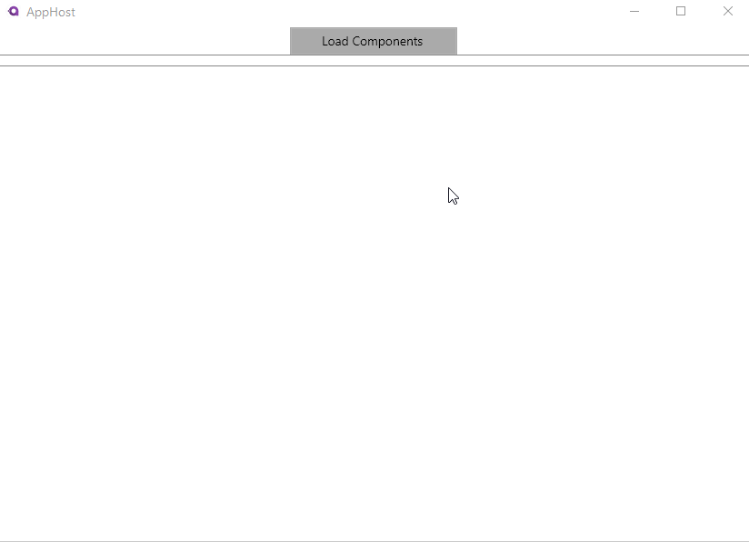
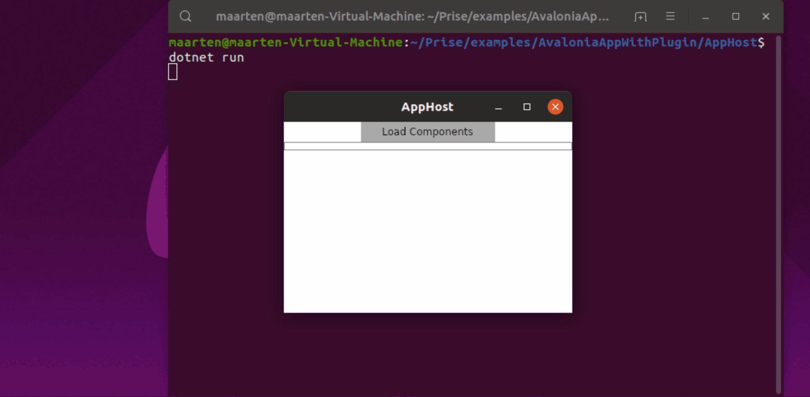

## Version 1.2.1 introduces support for preferred plugin dependency load strategies

Up until version **1.2.0**, any third party dependency from your plugin would be loaded from the **dependency context first**, the plugin folder second and lastly from the host appdomain.

With version **1.2.1**, you can specify a **preferred loading strategy** by providing a `DependencyLoadPreference`.
This was required for this example to be fully functional, all **Avalonia assemblies** needed to be loaded from the **current AppDomain** in order for a XAML based plugin-system to work using Prise.

Prise initially tries to decouple the host from the plugin by **serializing an deserializing** the **parameters** and **result** when interacting with the plugin. Because the Contract for this example returns a `UserControl`, a **Avalonia-specific** class, we cannot serialize this and thus the interaction with the plugin did not work.

In order for the host to receive the **UserControl**, the plugin needs to load its dependencies **from the host AppDomain**. This puts a **limitation on the app**, meaning if the AppHost ever upgrades their dependencies to a newer version of Avalonia. So must the plugin.

In the AppHost.Program file, you'll see that the preferred loading strategy is AppDomain `WithLocalDiskAssemblyLoader("Plugins", DependencyLoadPreference.PreferAppDomain)`. However, that is not enough. Since we are tightly hooking the plugin into our host AppDomain, we can now completely bypass serialization. Please see the `AvaloniaPluginResultConverter` for this.

### Run the example
The **AppHost** will allow you to load all plugins from the **Components** assembly and display a list. Clicking on the component will load the **UserControl** and XAML into the **MainWindow**.

There are three components exposed by the Components plugin assembly, **BonjourToutLeMonde**, **HalloWereld** and **HelloWorld**. The Contract specifies a name for the Component and the UserControl which can be loaded.

First, copy over the plugins by running the `cake` command in the root of this directory. This will compile and copy over the plugin assembly to the **AppHost**.

Now, we will test this using our the **AppHost** application.

You can start the application using the `dotnet run` command from within the AppHost directory.

### TOO LONG DID NOT READ
Compile and copy the plugin by using the `cake` command from inside the Components directory.
Launch the MyHost application using the `dotnet run` command from inside the AppHost directory.

### Works on Ubuntu, too!

